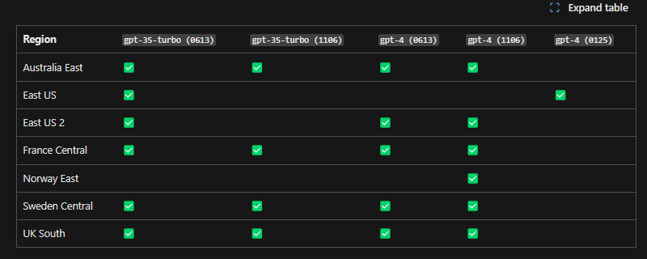
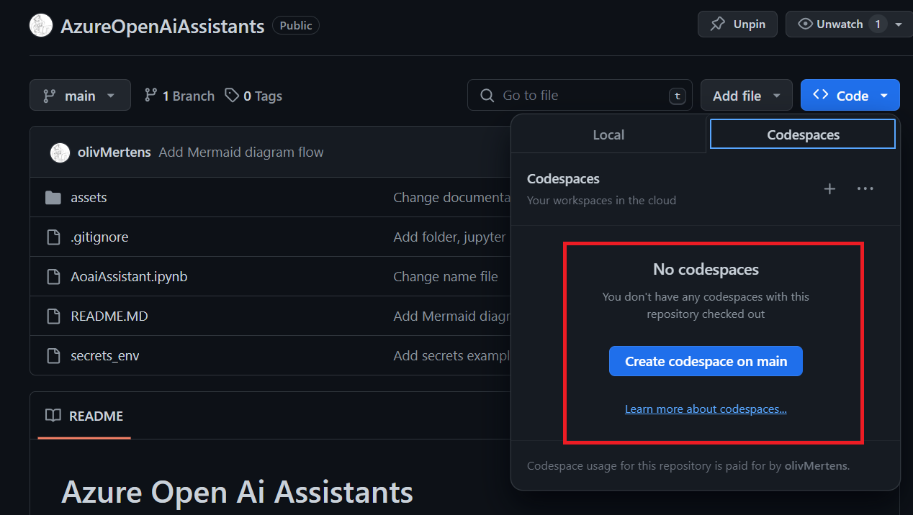

# Azure Open Ai Assistants 


this demo is based on [Learn Microsoft website](https://learn.microsoft.com/en-us/azure/ai-services/openai/assistants-quickstart?branch=pr-en-us-264938&tabs=command-line&pivots=programming-language-python#create-your-first-assistant)

Some other jupyter notebook will be available in the repository to show how to use assistants in a more complex way.

This demo will use python, library openAi and azure to create an assistant to use it in a jupyter notebook.

If you want to directly test in Azure Ai studio it's here [Azure OpenAi studio](https://oai.azure.com/)
> [Documentation for Azure Ai studio](https://learn.microsoft.com/en-us/azure/ai-services/openai/assistants-quickstart?tabs=command-line&pivots=programming-language-studio)


## Create your first assistant

### What's an assistant?

An assistant ( or many !) can perform a wide range of tasks, such as answering questions, providing recommendations, and executing commands 

An assistant could have some tools :
- Tool retrieval
- Tool code interpreter
- Tool Functions(Apis) 

You can use assistants to build a wide range of applications, such as chatbots, virtual agents, and more.

In clear you could create in a few line of code some assistant with tool(s) to create a pipeline of threads in order to adresse an ask or demand of the user.
the assistant will take the correct tool for the demand according to the ask of the user.

> in the same idea you could use different model by assistant to have a better response or to limit the cost of the assistant

You can create multiple assistants with different tools on one thread (async or not) to resolve a problem or to give a response to a user, you could also have diffents threads with different assistants
> Multi-Assistant Thread Runs with parallel function calls

In the end with this library you will retrieve response in json format, format easy to use in python and to make some process on it.

to create an orchestration of the assistant you will have to manage these:
- Thread id
- Message id
- assistant id


### List of demos for usecase

The first demo at the root of the repository is a simple assistant based on the documentation of Microsoft.
> AoaiAssistant.ipynb

| Name scenario | Description notebook | Link |
| ----- | ----------- | -------- |
| Math solving Assistant|  1 assistant with only code interpreter as tool | [AoaiAssistant.ipynb](AoaiAssistant.ipynb) |


### Prerequisites

you will need if you want to test the notebook in local:
- python 3.8 or later
- visual studio code and plugins :
    - Jupyter / jupyter Keymap / jupyter Cell Tags
    - Jupyter Notebook renderers
- An [Azure subscription - 200 $ for first subscription](https://azure.microsoft.com/en-us/free/) 
- Access to Azure OpenAi service [Request an access for AOAI](https://aka.ms/oai/access)
- Access to the lastet gpt4 1106 model ( Actually deployed actually in sweden , east us and west us 2)
    - you can refer to this link for the avaibility of model in region [Azure OpenAi model](https://docs.microsoft.com/en-us/azure/ai-services/openai/region-availability)
- Other models are compatible to use with this feature


- Deploy the service in portal azure for Azure open Ai service in the region accordly
- Make a deployment of the model in the [azure openAi service Ai studio](https://oai.azure.com/), give a name of deployment

__or__

Codespace to use the notebook in the cloud with Github


### Gather informations for the notebook
For the name of the deployment for the model ( you gave a name normally ) 
in Azure Ai studio, you can find it in the deployment section of the model if you don't remind it


You have to correctly modify the information in the secrets_env renamed in secrets.env
> the azure endpoint and the azure key aoai could be found in your azure portal

or
> directly in the conversation category in Ai studio ,with the model selected and the button code clicked in first step

And after you will have to click on the button "show secret" to obtain the key and the endpoint is displayed in the example code


You will have to click on each code step by the play button on the left of each cell

it there is no errors you will obtain at the last cell this json dump with the result and all the informations gathered 


When you are ready you can follow the steps in AzureAOAI.ipynb notebook
> In my case my model deplyment for gpt4-1106 is named  **gpt-4turbo**

You could now use the notebook python in visual studio code ( or inside a browser with codespace ) if you want to make some process on the result or some orchestration with the result of the assistant :

## DeepDive Aassistant instance

### Understand the interaction assistant / thread / message

Do you have created an assistant ?
Do you want to understand how manage thread and messages ?

First of all take a look at the documentations for understanding and started with assistants [on this link](https://learn.microsoft.com/en-us/azure/ai-services/openai/how-to/assistant)

It respect a specific flow to create a thread and to manage  message in a thread.


### format of json message

```json
{
  "data": [
    {
      "id": "msg_5Oc2nmN7boHKfYuJaOnxkYrQ",
      "assistant_id": "asst_vid43QSBUFAVr7f7nraAwfkS", // the id of the assistant
      "content": [
        {
          "text": {
            "annotations": [],
            "value": "The solution to the equation \\(3x + 11 = 14\\) is \\(x = 1\\)." // the result of the assistant
          },
          "type": "text"
        }
      ],
      "created_at": 1706827368,
      "file_ids": [],
      "metadata": {},
      "object": "thread.message",
      "role": "assistant",
      "run_id": "run_VlCTYceNmV8HlQyOLQUe7Xj6",
      "thread_id": "thread_KM402gTevvYxlfxYA1ONQPHP"
    },
    {
      "id": "msg_ZHWVk1gJT292L4YJzlbLjmFq",
      "assistant_id": null,
      "content": [
        {
          "text": {
            "annotations": [],
            "value": "I need to solve the equation `3x + 11 = 14`. Can you help me?" // the rquest of the user
          },
          "type": "text"
        }
      ],
      "created_at": 1706827327,
      "file_ids": [],
      "metadata": {},
      "object": "thread.message",
      "role": "user",
      "run_id": null,
      "thread_id": "thread_KM402gTevvYxlfxYA1ONQPHP" // id of the thread
    }
  ],
  "object": "list",
  "first_id": "msg_5Oc2nmN7boHKfYuJaOnxkYrQ", // the id of the first message - request user
  "last_id": "msg_ZHWVk1gJT292L4YJzlbLjmFq", // Last message of the thread
  "has_more": false
}

```	
The code interpreter tools convert in python code.
In this usecase, if you want to verify the solution of the assistant for mathematics problem
with dedicate library like sympy or numpy

### Parameters assistant

Theses informations are extracted from the openAi library in python
 [library python openai](https://github.com/openai/openai-python/blob/main/src/openai/resources/beta/assistants/assistants.py)

- Tools :
A list of tool enabled on the assistant. There can be a maximum of 128 tools per
  assistant. Tools can be of types `code_interpreter`, `retrieval`, or `function`.
- Name : The name of the assistant.

## Referals links

- [Assistants in-a-Box](https://github.com/Azure/AI-in-a-Box/tree/main/gen-ai/Assistants)
- [Announcement Assistants technical blog](https://techcommunity.microsoft.com/t5/ai-azure-ai-services-blog/azure-openai-service-announces-assistants-api-new-models-for/ba-p/4049940)
- [Getting started with assistants](https://learn.microsoft.com/en-us/azure/ai-services/openai/how-to/assistant)
